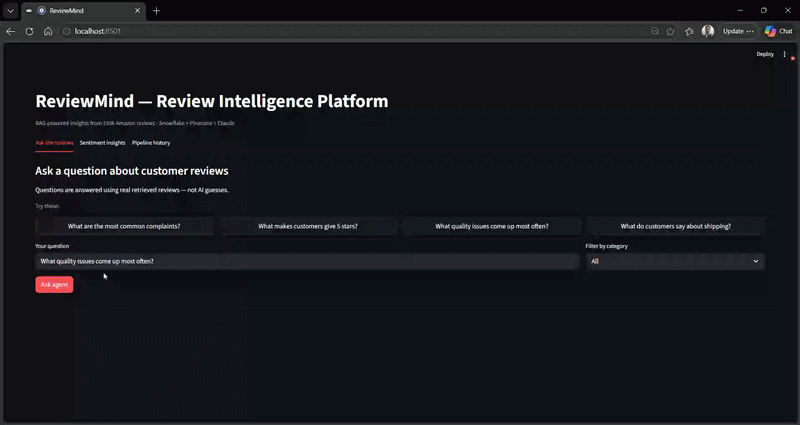

# ReviewMind — Review Intelligence Pipeline



## What this is
An end-to-end data engineering and RAG pipeline built on PySpark, Snowflake,
Pinecone, and Claude AI. It ingests 150k Amazon product reviews, processes
them at scale with PySpark (cleaning + sentiment scoring), stores embeddings
in Pinecone, and serves a RAG agent that answers questions grounded in
real customer reviews — all orchestrated by Apache Airflow.

## Architecture
- **Ingestion**: 150k Amazon reviews via Hugging Face datasets
- **Processing**: PySpark job — cleaning, feature engineering, VADER sentiment
- **Storage**: Snowflake (structured) + Pinecone (vector index, 20k embeddings)
- **RAG Agent**: question → embed → Pinecone search → Claude → grounded answer
- **Orchestration**: Airflow DAG chains all pipeline steps on a daily schedule
- **Dashboard**: Streamlit — ask questions, view sentiment trends, pipeline logs

## Tech stack
PySpark · Snowflake · Pinecone · Apache Airflow · Claude API · sentence-transformers · Streamlit · Python

## Quick start
```bash
git clone https://github.com/YOUR_USERNAME/reviewmind
cd reviewmind
python -m venv venv && venv\Scripts\activate
pip install -r requirements.txt
cp .env.example .env        # fill in credentials
python data/download_data.py
python data/load_to_snowflake.py
python pipeline/spark_clean.py
python pipeline/load_processed.py
python pipeline/embed_and_index.py
streamlit run app/dashboard.py
```

## Orchestration
Apache Airflow DAG (`airflow/dags/reviewmind_pipeline.py`) chains all
pipeline steps on a daily 6am schedule:

health_check → spark_clean → load_to_snowflake → embed_and_index → log_success

Each task has retry logic (1 retry, 5min delay) and logs completion
back to REVIEWMIND.PIPELINE.RUN_LOG in Snowflake.


## Sample outputs
- [RAG agent demo](examples/sample_rag_run.txt)
- [Spark job output](examples/sample_spark_run.txt)
- [Sentiment stats](examples/sentiment_stats.json)

## Companion project
See also [RetailMind](https://github.com/C-Bhargava/retailmind) —
an agentic data quality monitor built on Snowflake Cortex and Claude.